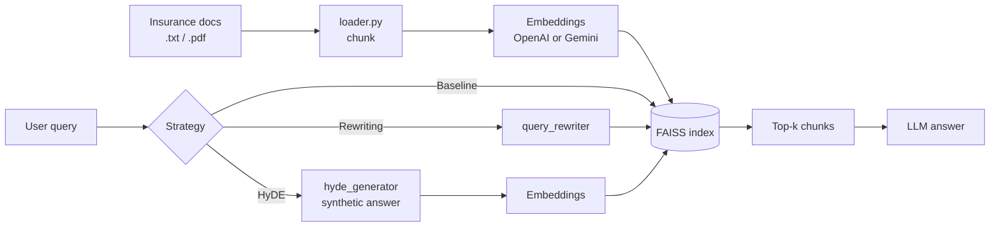

# Advanced RAG — Baseline vs. Query Rewriting vs. HyDE

A compact, end-to-end RAG playground that lets you compare **three retrieval
strategies** side-by-side on the same user query, against the same FAISS index,
using either **OpenAI** or **Google Gemini** as the LLM + embedding provider.

| # | Strategy | What happens |
|---|---|---|
| 1 | **Baseline RAG** | Embed the raw query → search FAISS → answer. |
| 2 | **Query Rewriting RAG** | LLM rewrites/expands the query first → embed rewritten → search → answer. |
| 3 | **HyDE RAG** | LLM drafts a *hypothetical* answer → embed the answer → search by that vector → answer. |

> HyDE = *Hypothetical Document Embeddings* ([paper](https://arxiv.org/abs/2212.10496)).
> It usually outperforms the baseline on short / under-specified queries.

---

## 📁 Project Structure

```
ADVANCED_RAG_HYDE/
├── app.py                     # entry point — runs all three strategies
├── config.yaml                # provider, models, paths, top_k
├── requirements.txt
├── .env                       # OPENAI_API_KEY / GOOGLE_API_KEY  (gitignored)
├── .gitignore
├── readme.md
├── exp_nb.ipynb               # exploratory notebook
│
├── data/
│   ├── raw/insurance_docs/    # source corpus (.txt / .pdf)
│   └── embeddings/            # auto-generated FAISS indexes (gitignored)
│       ├── faiss_openai/
│       └── faiss_gemini/
│
└── utils/
    ├── __init__.py
    ├── common.py              # paths, config cache, LLM & embedding factories
    ├── loader.py              # document loading + chunking
    ├── retriever.py           # FAISS build / load
    ├── query_rewriter.py      # strategy #2
    └── hyde_generator.py      # strategy #3
```

---

## ⚙️ How It Works



- `utils/common.py` is the **single source of truth** for paths, config, and
  LLM/embedding instances — everything else imports from it.
- All paths are anchored to the project root, so the app works regardless of
  the current working directory.
- The FAISS index is created on first run and reused on subsequent runs.

---

## 🚀 Quickstart

### 1. Clone and set up a virtual environment
```bash
git clone <your-repo-url>
cd ADVANCED_RAG_HYDE

python -m venv venv
source venv/bin/activate          # Windows: venv\Scripts\activate

pip install --upgrade pip
pip install -r requirements.txt
```

### 2. Add your API keys
Create a `.env` file in the project root:
```env
OPENAI_API_KEY=sk-...
GOOGLE_API_KEY=AIza...
```
(Only the key for the provider you select in `config.yaml` is required.)

### 3. Drop documents into the corpus folder
```
data/raw/insurance_docs/
    policy_terms.txt
    claim_procedure.txt
    your_other_docs.pdf
```

### 4. Run
```bash
python app.py
```
You'll be prompted for a question. The script runs all three strategies and
prints each answer.

---

## 🔧 Configuration (`config.yaml`)

```yaml
llm:
  provider: "openai"            # openai | gemini
  model_openai: "gpt-4o-mini"
  model_gemini: "gemini-2.5-flash"
  temperature: 0.3
  max_tokens: 1000

embedding:
  openai_model: "text-embedding-3-small"      # dim = 1536
  gemini_model: "models/text-embedding-004"   # dim = 768

vectordb:
  faiss_openai: "./data/embeddings/faiss_openai"
  faiss_gemini: "./data/embeddings/faiss_gemini"

retrieval:
  top_k: 5
```

Switching providers is a one-line change (`provider: "gemini"`).
A separate FAISS index is maintained per provider because embedding dimensions differ.

> **⚠️ Important:** If you change `embedding.openai_model` (or the gemini one),
> delete the corresponding folder under `data/embeddings/` so it's rebuilt.

---

## 💬 Example Session

```
🚀 Active Provider: OPENAI
✅ Loaded 2 docs → 12 chunks
⚠️ No FAISS index at /.../data/embeddings/faiss_openai. Building a new one...
✅ Created new FAISS index at: /.../data/embeddings/faiss_openai

🔍 Enter your question: What is a cashless policy?

==============================
  ✅ BASELINE RAG
==============================
Q: What is a cashless policy?
A: A cashless policy lets policyholders receive treatment at network hospitals
   without paying upfront ...

==============================
  ✅ QUERY REWRITING + RAG
==============================
🔁 Rewritten Query → Explain what a cashless health insurance policy means ...
A: ...

==============================
  ✅ HyDE RAG
==============================
🧪 Synthetic HyDE Answer:
A cashless policy is a feature of health insurance that ...
A: ...
```

---

## 🧠 Strategy Notes

### Baseline
The simplest setup — embed the raw query and retrieve. Fails when the query is
too short, too vague, or uses different terminology than the documents.

### Query Rewriting
Uses the LLM to **clarify and expand** the query before retrieval. Great when
users type fragments like *"cashless?"* — the LLM turns it into
*"Explain what a cashless health insurance policy is and how it works."*

### HyDE
Generates a **hypothetical answer** with the LLM, embeds *that*, and retrieves
documents close to the hypothetical answer in vector space. This works because
real documents are typically more similar to plausible answers than to short
questions.

| Strategy | Extra LLM calls | When it wins |
|---|---|---|
| Baseline | 1 (final answer) | Specific, well-formed queries |
| Rewriting | 2 (rewrite + answer) | Vague / under-specified queries |
| HyDE | 2 (hypothetical + answer) | Short queries, jargon mismatch, domain-specific corpora |

---

## 🛠️ Troubleshooting

| Symptom | Fix |
|---|---|
| `FileNotFoundError: config.yaml` | Make sure you're in the project root, or use absolute paths (project already does this). |
| `IndexError: list index out of range` during FAISS build | `data/raw/insurance_docs/` contains only empty files — add real content. |
| `RuntimeError: could not open .../index.faiss` | Delete stale `data/embeddings/<provider>/` and rerun to rebuild. |
| Wrong / hallucinated answers | Increase `retrieval.top_k`, add more docs, or try HyDE. |
| `openai.AuthenticationError` | Check `OPENAI_API_KEY` in `.env`. |

---

## 🧪 Development Tips

- Use [exp_nb.ipynb](exp_nb.ipynb) to prototype individual components
  (loader, retriever, rewriter, HyDE) in isolation.
- Toggle providers in `config.yaml` to A/B test embedding quality.
- `utils/common.py` caches `load_config()` with `lru_cache` — call it freely.

---

## 📦 Requirements

Python 3.10+ recommended. Key dependencies:

- `langchain`, `langchain-openai`, `langchain-google-genai`
- `langchain-community` (FAISS wrapper)
- `faiss-cpu`
- `openai`, `google-generativeai`
- `python-dotenv`, `PyYAML`, `numpy`

See [requirements.txt](requirements.txt) for pinned versions.

---

## 🔒 Security

- `.env` is gitignored — **never commit API keys**.
- `FAISS.load_local(..., allow_dangerous_deserialization=True)` is safe **only
  for indexes you created yourself**. Do not load FAISS pickles from untrusted
  sources.

---

## 📜 License

MIT (or whichever you choose) — update this section as needed.
